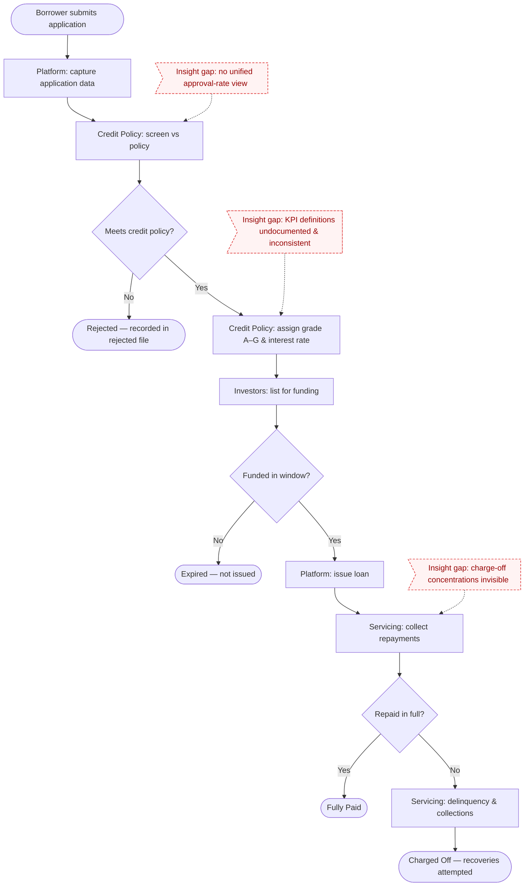
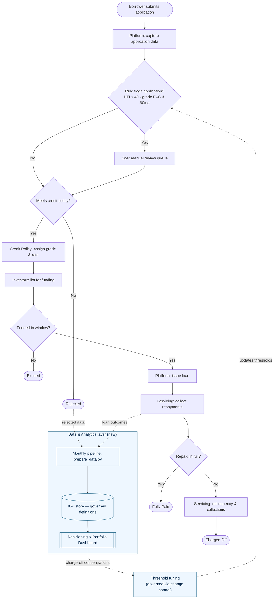

# Process Maps — As-Is and To-Be

> Scenario is hypothetical; all data is real LendingClub public data (2007–2018).
>
> These Mermaid diagrams render natively on GitHub and serve as the blueprint for the BPMN
> swimlane versions in draw.io (`as-is-lending-process.png`, `to-be-decisioning-process.png`).
> The actor for each step is shown in **[brackets]**; in draw.io each actor becomes a swimlane.

## As-Is — current lending & servicing process

**Swimlanes for draw.io (5 lanes):** Borrower · Platform · Credit Policy · Investors · Servicing.
Annotate the three insight gaps in red text where they occur (these are the gaps the project
closes, and the gap paragraph that goes into the BRD).

## To-Be — decisioning dashboard + risk-review loop

**What's new vs as-is (the three additions to make in draw.io):**
1. A **Data & Analytics lane**: monthly pipeline → governed KPI store → Decisioning & Portfolio
   Dashboard, fed by both issued-loan outcomes and rejected applications.
2. A **rule-flag gateway** before the policy decision that routes flagged applications
   (DTI > 40, or grade E–G on 60-month terms) into an **Ops manual-review queue**.
3. A **feedback loop**: the dashboard surfaces charge-off concentrations → threshold tuning →
   updated rules, all **governed via change control** (this is where CR-001 will enter later).
